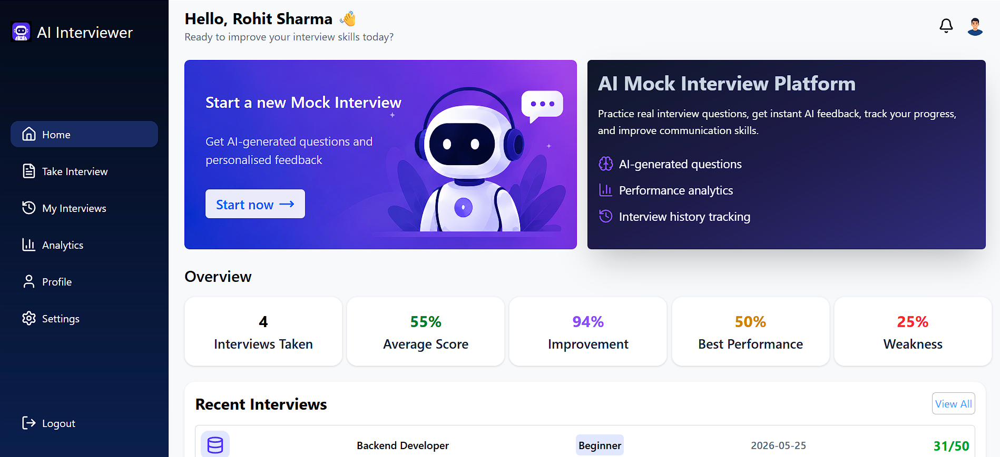
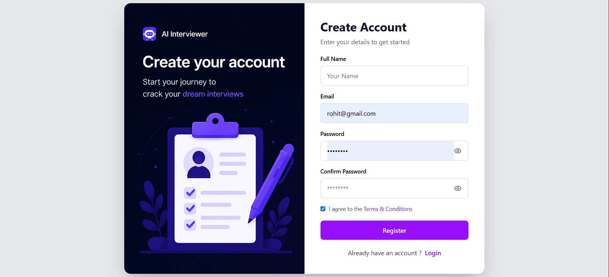
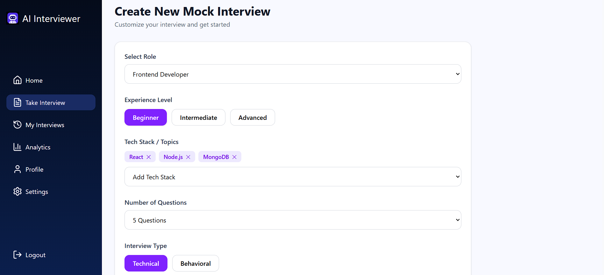
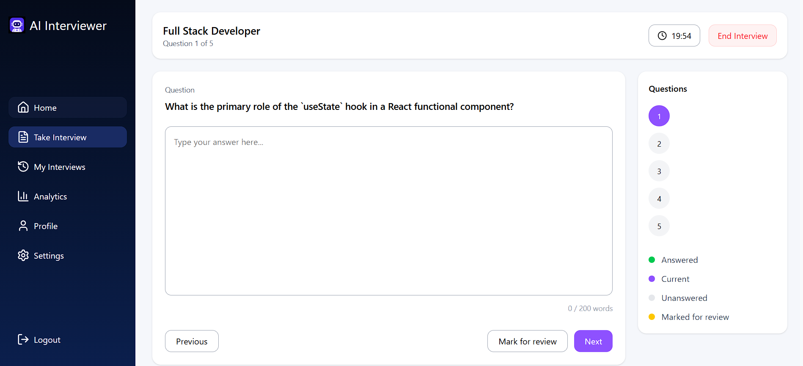
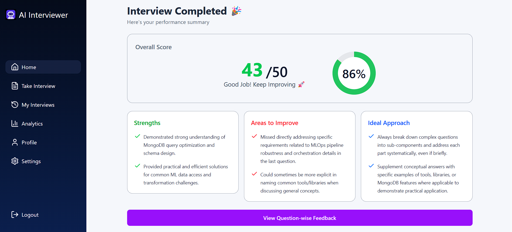
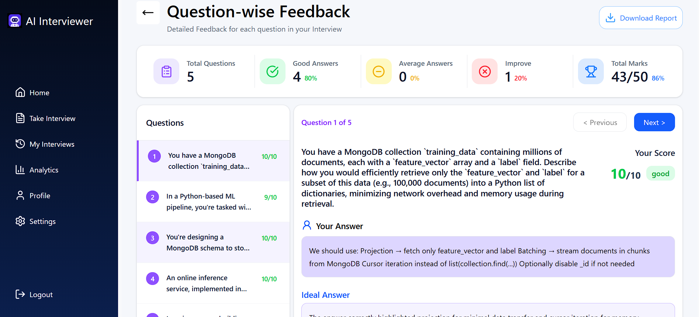
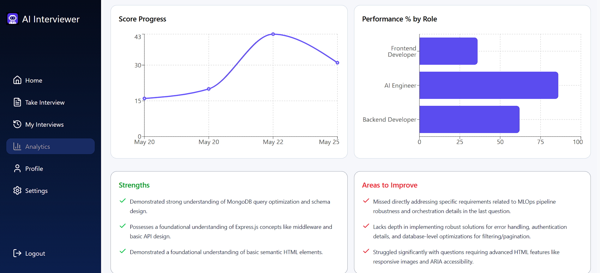
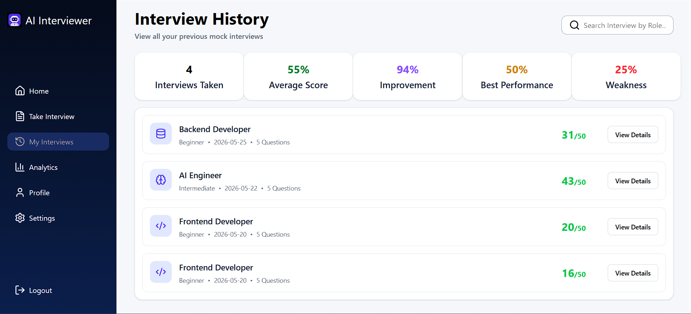
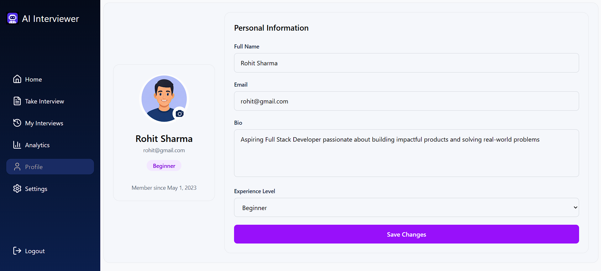
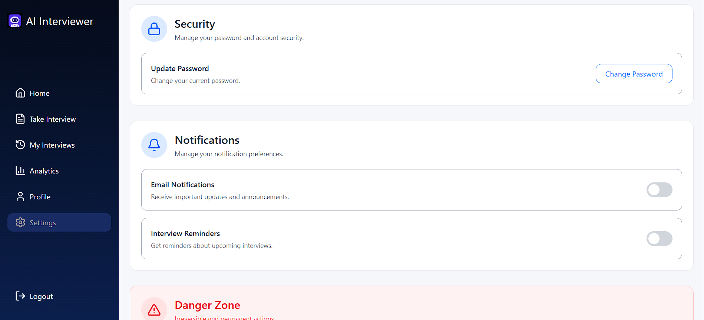

# AI Interviewer 🚀

An AI-powered mock interview platform that helps users practice technical interviews, improve communication skills, receive AI-generated feedback, and track interview performance through analytics.

Built using the MERN Stack with AI integration.

---

# Features

## Authentication System
- User Registration
- User Login & Logout
- JWT Authentication
- Cookie-based Authentication
- Protected Routes
- Forgot Password using Email
- Reset Password with Token Verification
- Update Password
- Delete User Account

---

## AI Interview Features
- Generate AI-powered interview questions
- Role-based interview generation
- Technical interview simulation
- Dynamic interview sessions
- Timer-based interview flow
- Automatic submission when timer ends
- AI evaluation of answers
- AI-generated feedback and scores
- Download the pdf version of the feedback

---

## Analytics Dashboard
- Interview History
- Overall Performance Overview
- Score Progress Tracking Graph
- Role-wise Performance Graph
- Feedback Analysis

---

## User Profile Features
- Update User Profile
- Upload Profile Image
- Manage Bio
- Manage Experience Level

---

## Frontend Features
- Responsive UI Design
- Protected Layout System
- React Router Navigation
- Reusable Components
- Context API State Management
- Loading State Handling

---

# Screenshots

## Home Page

<p align="center">
  
</p>

---

## Register Page

<p align="center">
  
</p>

---

## Interview Page

<p align="center">
  
</p>

---

## Interview Session

<p align="center">
  
</p>

---

## Result Page

<p align="center">
  
</p>

---

## Question-wise Feedback

<p align="center">
  
</p>

---

## Analytics Dashboard

<p align="center">
  
</p>

---

## Interview History

<p align="center">
  
</p>

---

## Profile Page

<p align="center">
  
</p>

---

## Settings Page

<p align="center">
  
</p>

# Tech Stack

## Frontend
- React.js
- React Router DOM
- Tailwind CSS
- Axios
- Context API

---

## Backend
- Node.js
- Express.js
- MongoDB
- Mongoose
- JWT Authentication
- Bcrypt.js
- Multer
- Nodemailer
- Cookie Parser

---

## AI Integration
- Gemini API / OpenAI API

---

# Project Structure

```bash
project-root/
│
├── backend/
│   ├── config/
│   ├── controllers/
│   ├── middlewares/
│   ├── models/
│   ├── routes/
│   ├── services/
│   ├── uploads/
│   ├── utils/
│   ├── package.json
│   └── server.js
│
├── frontend/
│   ├── assets/
│   ├── components/
│   ├── context/
│   ├── pages/
│   ├── services/
│   ├── utils/
│   ├── App.jsx
│   ├── main.jsx
│   └── index.css
│
├── .gitignore
└── README.md
```

---

# Frontend Routes

```jsx
/login
/reset-password/:token

/
/interview
/my-interviews
/analytics
/profile
/settings
/interview/:id
/result/:id
/feedback/:id
```

---

# Backend API Routes

## User Routes

```http
POST   /api/user/register
POST   /api/user/login
POST   /api/user/logout
GET    /api/user/me
PUT    /api/user/update
PUT    /api/user/update-password
DELETE /api/user/delete
POST   /api/user/forgot-password
POST   /api/user/reset-password/:token
```

---

## Interview Routes

```http
POST /api/interview/generate
GET  /api/interview/test-ai
GET  /api/interview/:id
POST /api/interview/result/:id
```

---

## Analytics Routes

```http
GET /api/analytics/history
GET /api/analytics/overview
GET /api/analytics/score-progress
GET /api/analytics/role-performance
GET /api/analytics/feedback
```

---


# Authentication Flow

1. User registers or logs in
2. JWT token gets generated
3. Token stored in cookies
4. Protected routes verify authentication
5. User accesses protected pages

---

# Password Reset Flow

1. User enters registered email
2. Reset token is generated
3. Reset link sent via email
4. User opens reset password page
5. User sets new password

---

# AI Interview Flow

1. User selects role/technology
2. AI generates interview questions
3. User attends interview session
4. Timer tracks interview duration
5. Answers are submitted
6. AI evaluates performance
7. Feedback and analytics are generated

---

# Middleware Used

- Authentication Middleware
- Multer Upload Middleware
- Cookie Parser Middleware
- Error Handling Middleware

---

# Security Features

- Password Hashing using Bcrypt
- JWT Authentication
- Protected Backend Routes
- Secure Password Reset Tokens
- Cookie-based Authentication
- Input Validation

---

# Future Improvements

- Voice-based Interviews
- Video Interview Support
- Resume Analyzer
- Dark Mode
- Leaderboard System
- Real-time Coding Interviews
- Multi-language Support
- Interview Recording Playback

---

# Author

## Rajesh Kumar